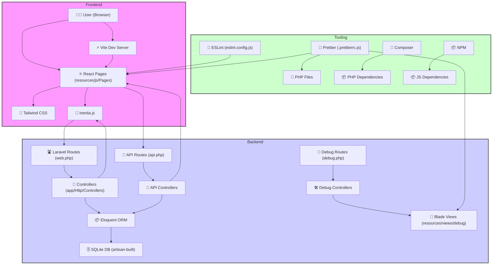

<p align="center"><a href="https://laravel.com" target="_blank"></a></p>

<p align="center">
<a href="https://github.com/laravel/framework/actions"></a>
<a href="https://packagist.org/packages/laravel/framework"></a>
<a href="https://packagist.org/packages/laravel/framework"></a>
<a href="https://packagist.org/packages/laravel/framework"></a>
</p>

# QGo-QMS - Queue Management System

This project is a Queue Management System built with Laravel, Inertia.js, and React.

## Setup Guide

This guide assumes you have a local development environment that provides PHP, a web server (like NGINX), Composer, and Node.js/NPM. [Laravel Herd](https://herd.laravel.com/) is recommended as it bundles these requirements.

1.  **Clone the repository:**
    ```bash
    git clone <your-repository-url>
    cd qgo-qms
    ```
2.  **Install PHP dependencies:**
    ```bash
    composer install
    ```
3.  **Install Node.js dependencies:**
    ```bash
    npm install
    ```
4.  **Set up environment variables:**
    Copy the `.env.example` file to `.env` and configure your database connection and other environment-specific settings.
    ```bash
    cp .env.example .env
    php artisan key:generate
    ```
5.  **Run database migrations and seeders:**
    This command will reset your database and populate it with initial data (users, services, counters).
    ```bash
    php artisan migrate:fresh --seed
    ```
6.  **Run the development server:**
    This command starts the Vite development server for handling frontend assets (CSS, JS).
    ```bash
    npm run dev
    ```
7.  **Serve the application:**
    Use your local development server (like Laravel Herd or `php artisan serve`) to access the application in your browser.

## Architectural Diagram

This application follows a modern web architecture leveraging Laravel for the backend and React with Inertia.js for the frontend.


## Architecture Overview

*   **Backend (Laravel):**
    *   Handles routing (`routes/web.php`, `routes/api.php`), database interactions (Eloquent ORM), authentication, and business logic.
    *   **API:** Custom API endpoints are defined in `routes/api.php` and implemented in controllers within `app/Http/Controllers` (e.g., `QueueController.php`, `CounterController.php`) to serve data to the frontend.
    *   **Database:** Uses Laravel's migration system (`database/migrations`) and seeding (`database/seeders`) for database schema management and initial data population.
    *   **Debug Views:** Initial testing and basic functionality were developed using Laravel Blade templates located in `resources/views/debug`. These are generally not part of the main user-facing application but were useful during early development.

*   **Frontend (React + Inertia.js):**
    *   **Inertia.js:** Acts as the bridge between the Laravel backend and the React frontend, allowing for the creation of a single-page application (SPA) experience without building a separate API for everything.
    *   **React:** Used for building the user interface components. Page components are located in `resources/js/Pages`.
    *   **State Management:** State is primarily managed locally within the React components (`.jsx` files).
    *   **Data Fetching:** The application uses a basic polling mechanism (fetching data every second via the API) to keep the displayed information (like queue status and counter availability) up-to-date. Future iterations could explore WebSockets or dedicated real-time database providers (e.g., Firebase, Supabase) for more efficient updates.
    *   **Styling:** [Tailwind CSS](https://tailwindcss.com/) is used for utility-first styling across most components. Configuration is in `tailwind.config.js`.
    *   **Asset Bundling:** [Vite](https://vitejs.dev/) is used for fast frontend asset bundling and development server (`vite.config.js`).

*   **Code Quality & Formatting:**
    *   **ESLint:** Configured in `eslint.config.js` (using the new flat config format) with various plugins to enforce JavaScript and React coding standards.
    *   **Prettier:** Used for automatic code formatting to maintain consistency. Configuration is in `.prettierrc.js`, including plugins for PHP, Blade, and Tailwind CSS class sorting.

## Credits & Packages

This project utilizes several open-source packages. Notable mentions include:

*   **[React](https://reactjs.org/)**: The core library for building the user interface.
*   **[Inertia.js](https://inertiajs.com/)**: For connecting the Laravel backend with the React frontend.
*   **[Tailwind CSS](https://tailwindcss.com/)**: For utility-first CSS styling.
*   **[Vite](https://vitejs.dev/)**: For frontend tooling and development server.
*   **[react-icons](https://react-icons.github.io/react-icons/)**: Used for incorporating icons into the UI.
*   **[react-table](https://react-table.tanstack.com/)**: Powers the sortable and paginated tables in the Admin Dashboard (`resources/js/Pages/Dashboard.jsx`).
*   **[react-to-print](https://github.com/gregnb/react-to-print)**: Enables printing of queue tickets directly from the browser (`resources/js/Pages/Landing.jsx`).
*   **[SweetAlert2](https://sweetalert2.github.io/)**: For displaying user-friendly alerts and confirmations.
*   **[Day.js](https://day.js.org/)**: For date and time formatting.

Thanks to the creators and maintainers of these and all other dependencies listed in `package.json` and `composer.json`.

### Development Environment & Tooling

Development was aided by Visual Studio Code and the following extensions:

*   **ESLint**: Integrates ESLint into VS Code.
*   **GitHub Copilot + Chat**: AI pair programmer and chat assistant.
*   **Laravel**: Provides Laravel-specific snippets and utilities.
*   **Laravel Blade Snippets**: Adds Blade syntax highlighting and snippets.
*   **PostCSS Language Support**: Adds PostCSS syntax highlighting.
*   **Roo Code**: AI coding assistant (that's me!).
*   **SQLite Viewer**: Allows viewing and querying SQLite databases within VS Code.
*   **Tailwind CSS IntelliSense**: Provides autocompletion, linting, and previews for Tailwind CSS.

## About Laravel

Laravel is a web application framework with expressive, elegant syntax. We believe development must be an enjoyable and creative experience to be truly fulfilling. Laravel takes the pain out of development by easing common tasks used in many web projects.

*   [Official Documentation](https://laravel.com/docs)
*   [Laracasts](https://laracasts.com)
*   [Laravel News](https://laravel-news.com)

## Contributing

Thank you for considering contributing to the Laravel framework! The contribution guide can be found in the [Laravel documentation](https://laravel.com/docs/contributions).

## Code of Conduct

In order to ensure that the Laravel community is welcoming to all, please review and abide by the [Code of Conduct](https://laravel.com/docs/contributions#code-of-conduct).

## Security Vulnerabilities

If you discover a security vulnerability within Laravel, please send an e-mail to Taylor Otwell via [taylor@laravel.com](mailto:taylor@laravel.com). All security vulnerabilities will be promptly addressed.

## License

The Laravel framework is open-sourced software licensed under the [MIT license](https://opensource.org/licenses/MIT).
